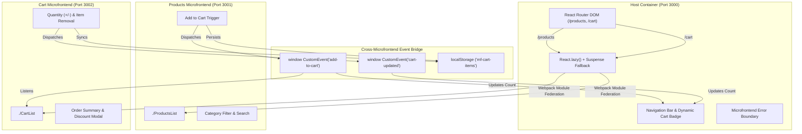

# React Microfrontend Architecture

A production-grade, enterprise Microfrontend Architecture implementation built using **Webpack 5 Module Federation**, **React 18**, and an asynchronous event-driven state bridge.

Developed for the **React Developer Evaluation** at **Version Next Technologies Private Limited**.

---

## 🏗️ Architecture Overview

The system is composed of three independently buildable and deployable React applications:

| Application | Role | Port | Exposes / Remotes | Standalone URL |
| :--- | :--- | :--- | :--- | :--- |
| **Host App** | Container / Orchestrator | `3000` | Consumes `products` & `cart` | [http://localhost:3000](http://localhost:3000) |
| **Products App** | Remote Microfrontend | `3001` | Exposes `./ProductsList` | [http://localhost:3001](http://localhost:3001) |
| **Cart App** | Remote Microfrontend | `3002` | Exposes `./CartList` | [http://localhost:3002](http://localhost:3002) |

### System Diagram



---

## ⚡ Key Technical Features

### 1. Webpack 5 Module Federation
- Configured with `ModuleFederationPlugin` across all three apps.
- **Remotes in Host**:
  ```javascript
  remotes: {
    products: "products@http://localhost:3001/remoteEntry.js",
    cart: "cart@http://localhost:3002/remoteEntry.js",
  }
  ```
- **Exposes in Remotes**:
  - Products: `exposes: { "./ProductsList": "./src/ProductsList" }`
  - Cart: `exposes: { "./CartList": "./src/CartList" }`
- **Shared Singletons**: `react`, `react-dom`, and `react-router-dom` are shared with `singleton: true` to prevent duplicate React runtime instances and ensure hook compatibility across boundaries.

### 2. Cross-Microfrontend Communication
- Fully decoupled communication through native `window.dispatchEvent` with custom events (`add-to-cart`, `cart-updated`).
- Persistent state backup via `localStorage` ensuring items remain consistent on route transitions, unmounts, or page reloads.
- Live Badge Counter in the Container navbar that reactively updates whenever products are added or cart quantities change.

### 3. Resilient Error Boundaries & Standalone Execution
- Host app includes a `MicrofrontendErrorBoundary` that catches network/remote failures with intuitive diagnostic feedback and connection retries.
- Each microfrontend can be run and tested **100% standalone** by visiting `http://localhost:3001` or `http://localhost:3002`.

---

## 🚀 Quick Start & Installation

### Option 1: One-Command Setup (Recommended)

From the project root:

```bash
# 1. Install dependencies across root and all 3 microfrontends
npm run install:all

# 2. Start all 3 microfrontends concurrently
npm start
```

### Option 2: Step-by-Step Manual Setup

If you prefer running each app in a dedicated terminal window:

#### 1. Install Dependencies
```bash
# Products Microfrontend
cd products && npm install

# Cart Microfrontend
cd ../cart && npm install

# Host App
cd ../host && npm install
```

#### 2. Start Services (Start remotes before host)
```bash
# Terminal 1 — Products Remote (Port 3001)
cd products && npm start

# Terminal 2 — Cart Remote (Port 3002)
cd cart && npm start

# Terminal 3 — Host Container (Port 3000)
cd host && npm start
```

---

## 🧪 Testing & Verification Guide

1. **Access the Container App**:
   - Open **[http://localhost:3000](http://localhost:3000)**.
   - The `/products` route loads automatically.

2. **Browse & Add Products**:
   - Filter by categories (Peripherals, Audio, Displays, Accessories) or type in the search bar.
   - Click **Add to Cart** on any item.
   - Notice the toast confirmation and the real-time badge count update in the top navbar.

3. **Manage Cart**:
   - Click the **Cart** tab in the navbar (or visit `http://localhost:3000/cart`).
   - Adjust quantities using `+` and `-` buttons.
   - Apply promo code `VERSIONNEXT10` to get a 10% discount.
   - Click **Proceed to Checkout** to view the confirmation modal.
   - Remove individual items or click **Clear Cart**.

4. **Test Standalone Mode**:
   - Open **[http://localhost:3001](http://localhost:3001)** for the standalone Products catalog.
   - Open **[http://localhost:3002](http://localhost:3002)** for the standalone Cart management.

---

## 📁 Repository Directory Structure

```
microfrontend-demo/
├── package.json                 # Root orchestrator (concurrently, install:all, start)
├── README.md                    # Project documentation
├── host/                        # Container App (Port 3000)
│   ├── package.json
│   ├── webpack.config.js        # ModuleFederationPlugin (remotes config)
│   ├── public/
│   │   └── index.html
│   └── src/
│       ├── App.js               # Navbar, dynamic routes, badge counter, ErrorBoundary
│       ├── host.css             # Host styling & layout system
│       ├── bootstrap.js
│       └── index.js
├── products/                    # Products Microfrontend (Port 3001)
│   ├── package.json
│   ├── webpack.config.js        # ModuleFederationPlugin (exposes ./ProductsList)
│   ├── public/
│   │   └── index.html
│   └── src/
│       ├── ProductsList.js      # Product catalog, search, filter, event dispatcher
│       ├── products.css         # Products styling
│       ├── bootstrap.js         # Standalone runner
│       └── index.js
└── cart/                        # Cart Microfrontend (Port 3002)
    ├── package.json
    ├── webpack.config.js        # ModuleFederationPlugin (exposes ./CartList)
    ├── public/
    │   └── index.html
    └── src/
        ├── CartList.js          # Cart item list, qty controls, promo logic, event listener
        ├── cart.css             # Cart styling
        ├── bootstrap.js         # Standalone runner
        └── index.js
```

---

## 🛠️ Tech Stack

- **Framework**: React 18 (`react`, `react-dom`)
- **Routing**: React Router v6 (`react-router-dom`)
- **Bundler & Architecture**: Webpack 5 + Module Federation
- **Styling**: Modern Vanilla CSS with CSS Custom Properties, Glassmorphism, and Google Fonts (`Plus Jakarta Sans`)
- **Tooling**: Babel, Webpack Dev Server, Concurrently
